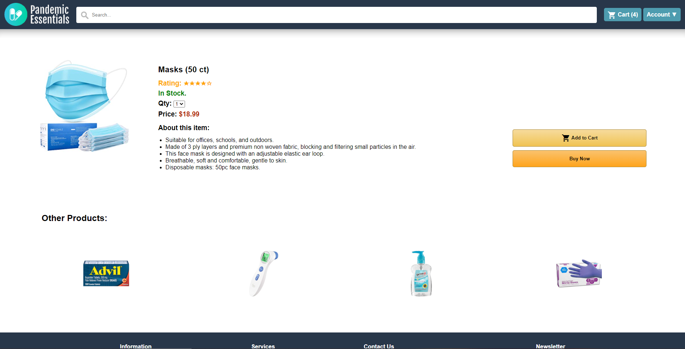
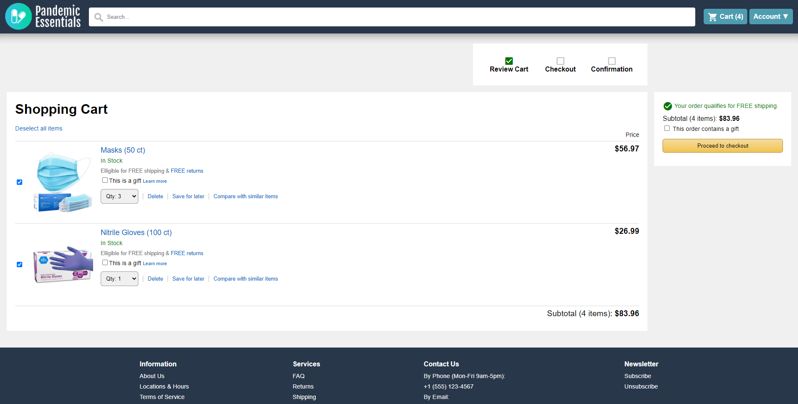
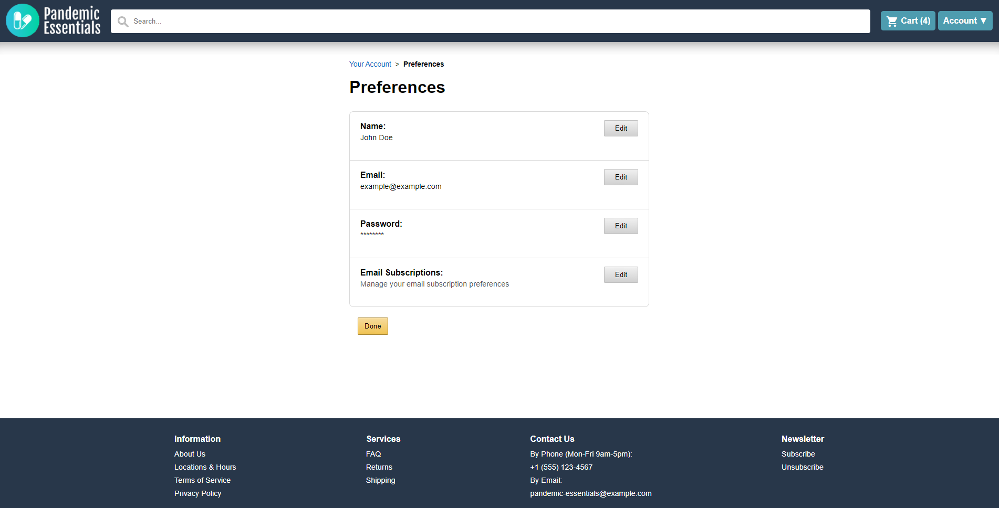

# Description

This is a storefront website intended to run on a Apache/MySQL/PHP stack.

No libraries are used in any code.

This site was created as an assignment for SFSU CSC317 Spring 2021.

# Setup

Requirements:
Apache (or another web server),
MySQL,
PHP

1. The contents of [/storefront-site](storefront-site) must be moved/copied into your webserver's root, or the webserver must be configured to serve the contents of [/storefront-site](storefront-site).
2. To set up the MySQL database, run [/setup-mysql.sql](setup-mysql.sql) in a MySQL shell.
3. To set up required environment variables, make a copy of [/storefront-site/.env.example](storefront-site/.env.example) and rename it `.env`.
    - MySQL credentials must be configured.
    - JWT_SECRET must be configured. Recommended to use a random string of 32-64 characters.
4. Setup and configuration complete!

# Screenshots

## Authors

All authors are students at San Francisco State University, San Francisco, California.
This project was created as group project for CSC 0317-04 Introduction to Web Software Development Spring 2021.

* **Olivier Chan Sion Moy**
* **Jinal Shah**
* **Jasneil Nat**
* **Jingxing Luo**

## License

This project is licensed under the MIT License - see the [LICENSE](LICENSE) file for details
